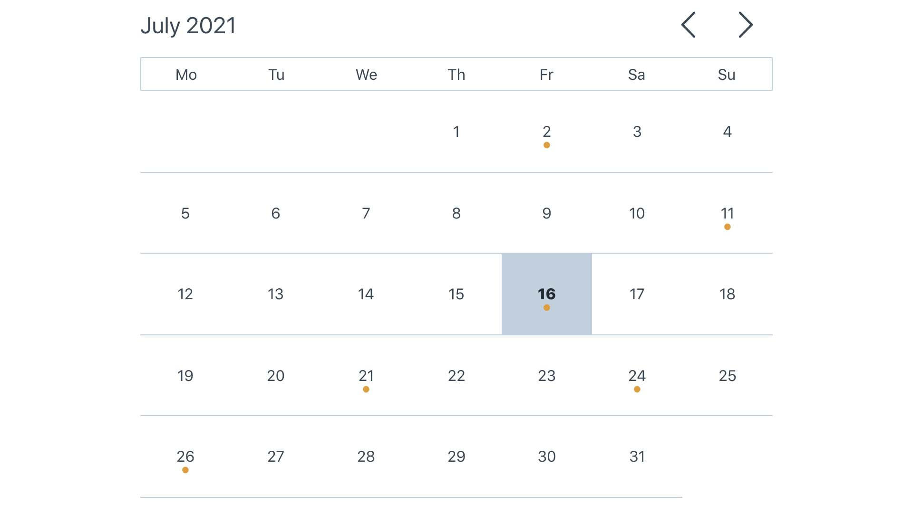

# Calendar App
[Demo](https://tbm85.github.io/demo-calendar-app/)

## Description
A calendar app made with React JS

This project was bootstrapped with [Create React App](https://github.com/facebook/create-react-app).

## Resources
* [Glegoo Font](https://fonts.google.com/specimen/Glegoo)
* [Icomoon Icons](https://icomoon.io/app/#/select)
* [Uuid generator](npmjs.com/package/uuid/v/8.3.2)

## How to run this app
* Clone: `git clone https://github.com/TBM85/demo-calendar-app.git`
* Enter in the directory: `cd demo-calendar-app`
* Install dependencies: `npm install`
* Start the app: `npm start`

## What can this application do?
* It shows current day
* It is possible to move between the different months, through the arrows that are in the upper right part of the calendar
* By clicking on a day, a modal appears, in which you can add, edit and delete the events of the selected day
* To edit an event click on it and save it by clicking on the check mark icon
* An orange dot is displayed below days that contain events

## License
Copyright (c) 2021 Tania Ballester. This project is using [MIT License](LICENSE.md)